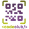

# Meu primeiro projeto

> <i> Este é o meu primeiro projeto, usando só HTML feito no curso do </i> <b>CodeClub</b>, <i> guiado pelo Professor </i> <b>Rodolfo Mori!</b> <i>Ele conta um pouco sobre mim, e meus sonhos ao me tornar um programador.</i>

## 🤝 Colaboradores

Agradecemos às seguintes pessoas que contribuíram para este projeto:

<table>
  <tr>
    <td align="center">
      <a href="#">
         
        
          <b>Leonardo Moraes</b>
        
      </a>
    </td>
    <td align="center">
  
  </tr>
</table>

